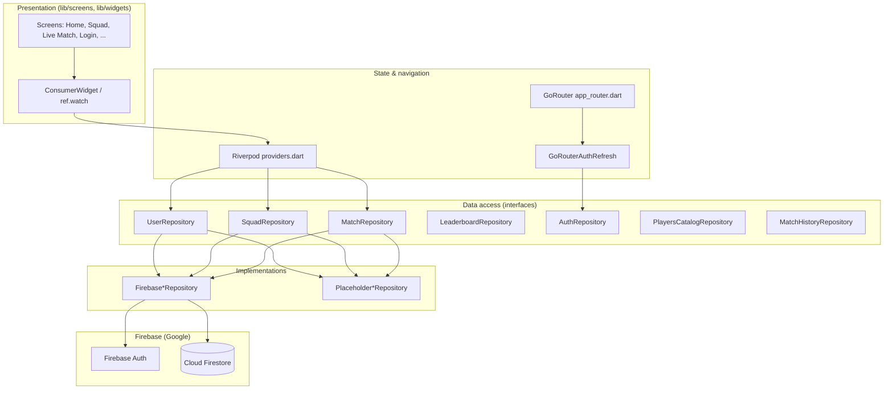

# Wicket Wars: Firebase, architecture & data flow (viva / backend-dev guide)

This document describes **how the Wicket Wars Flutter app is structured**, which **Firebase services** it uses, and **how data moves** from the UI to Firestore. It is written so you can explain the system in a **viva** or hand it to someone who thinks in terms of **REST backends** (e.g. Node.js + database).

**Stack (from `pubspec.yaml` — run `flutter pub outdated` to check for newer releases):**

| Piece | Package / role |
|--------|----------------|
| Language / UI | Flutter 3.x, Dart SDK `^3.7.2` |
| Navigation | `go_router` ^14.x |
| App state / DI | `flutter_riverpod` ^2.x |
| Firebase core | `firebase_core` ^4.x |
| Identity | `firebase_auth` ^6.x |
| Database | `cloud_firestore` ^6.x |
| Lab crypto demo | `encrypt` ^5.x (AES around auth — see [Password handling](#password-handling-lab-demo-vs-production)) |

There is **no Cloud Functions** in this project yet: all game reads/writes go **from the client** to **Firestore** and **Auth**, subject to **security rules**.

---

## 1. One-sentence summary

**Wicket Wars** is a Flutter **client-only** app: **Firebase Authentication** identifies users; **Cloud Firestore** stores profiles, squads, match history, leaderboards, live match rooms, and a read-only player catalog; the **UI** uses **GoRouter** + **Riverpod**; optional **in-memory placeholders** swap in when Firebase cannot start on a platform.

---

## 2. High-level architecture



**Layers (bottom to top):**

1. **Firebase** — managed auth + document database.
2. **Repositories** (`lib/data/repositories/`) — **interfaces** + **Firebase** and **placeholder** implementations; map Firestore ↔ Dart models.
3. **Providers** (`lib/data/providers.dart`) — choose Firebase vs placeholder and expose `Future` / `Stream` data to the UI.
4. **Screens & widgets** — consume providers with `ref.watch`; no Firestore imports in widgets (ideally).
5. **Router** (`lib/app_router.dart`) — URL → screen; **redirect** if not logged in.

---

## 3. Firebase services actually used

| Service | Role in Wicket Wars |
|---------|---------------------|
| **Firebase Auth** | Email/password sign-up, sign-in, sign-out; `authStateChanges` drives navigation. |
| **Cloud Firestore** | All persistent game data (see [Schema](#4-firestore-schema-paths)). |
| **Firebase project config** | `lib/firebase_options.dart` (FlutterFire) + Android `google-services.json` — tells the SDK which project to use. |

**Not used (yet):** Cloud Functions, Realtime Database, Storage, FCM, Remote Config, etc.

---

## 4. Firestore schema (paths)

Canonical string helpers: `lib/data/firestore_paths.dart`.  
Typed `CollectionReference` / `DocumentReference` helpers: `lib/data/firestore/firestore_refs.dart`.

| Path | Purpose |
|------|---------|
| `users/{uid}` | **Profile**: display name, coins, ranking points, league, W/L, daily streak, last daily reward time, totals, … |
| `users/{uid}/players/{playerId}` | **Squad cards** (up to 15 in app logic): tier, real vs custom, attributes, optional training. |
| `users/{uid}/matchHistory/{matchId}` | **Completed matches** for history UI and “friends” leaderboard hints. |
| `matchRooms/{roomId}` | **Online 1v1 room** (often `roomId` = 6-char code): host/guest UIDs, status, toss, scores, ball state, commentary tail. |
| `leaderboard/{uid}` | **Denormalised row** per user for global ranking (updated when profile is saved). |
| `players_catalog/{catalogId}` | **Read-only** templates for premium/licensed cards (seed in Console / Admin). |

**Codec:** `lib/data/firestore/firestore_codec.dart` normalises Firestore `Timestamp` values so `fromMap` factories stay consistent (similar to normalising DB rows in a backend repository).

---

## 5. Startup sequence (`lib/main.dart`)

Order matters — this is what you can draw on a whiteboard:

1. `WidgetsFlutterBinding.ensureInitialized()`
2. **`Firebase.initializeApp(options: DefaultFirebaseOptions.currentPlatform)`**  
   - If this throws **`UnsupportedError`**, **`AppEnvironment.useLocalData()`** is called: all providers use **placeholder** repositories (no Firestore).
3. **`goRouterAuthRefresh.listenToAuth(activeAuthRepository())`** — subscribes to auth stream so **`GoRouter`** rebuilds redirects on login/logout.
4. **`InMemoryStore.instance.ensureInitialized()`** — prepares placeholder store if needed.
5. **`runApp(ProviderScope(child: MyApp()))`** — Riverpod root; **`MaterialApp.router`** uses **`GoogleFonts`** theme (note: first run may fetch fonts unless bundled).

**Config files:** `firebase_options.dart`, Android `google-services.json`, and `applicationId` / Firebase package alignment in `android/app/build.gradle.kts`.

---

## 6. Authentication & navigation

**Repository:** `lib/data/repositories/firebase_auth_repository.dart` implements `AuthRepository` (sign in/up/out, `watchAuthState`).

**Router guard:** `lib/app_router.dart` — `refreshListenable: goRouterAuthRefresh`; **`redirect`** sends unauthenticated users to `/login` and signed-in users away from `/login` and `/signup`.

**Bridge:** `lib/auth/go_router_auth_refresh.dart` — `ChangeNotifier` that listens to **`watchAuthState()`** and calls **`notifyListeners()`** so GoRouter re-runs **`redirect`** (like “session changed” in a web app).

**Who is “logged in”?** `GoRouterAuthRefresh.isSignedIn` → `AuthRepository.currentUser != null` (backed by Firebase Auth when Firebase mode is on).

---

## 7. Riverpod: how screens get data

**File:** `lib/data/providers.dart`.

- **`AppEnvironment.useFirebase`** (default `true`) selects **`Firebase*Repository`** vs **`Placeholder*Repository`** for each interface.
- Common patterns:
  - **`authRepositoryProvider`**, **`userRepositoryProvider`**, …
  - **`authStateProvider`** — `StreamProvider<AppUser?>`
  - **`userProfileProvider`** — profile stream for current user
  - **`squadProvider(uid)`** — squad list stream
  - **`matchRoomProvider(roomId)`** — **live** room document stream (multiplayer)
  - **`leaderboardTopProvider`**, **`playersCatalogProvider`**, **`matchHistoryProvider`**, etc.

**Tests:** `test/widget_test.dart` uses **`ProviderScope(overrides: …)`** to inject placeholders — same idea as mocking a service in Jest.

---

## 8. Major features → code map (for viva “where is X?”)

| Feature | Screen(s) | Key providers / repos |
|---------|-----------|------------------------|
| Login / signup | `login_screen.dart`, `signup_screen.dart` | `authRepositoryProvider`, router redirect |
| Home / daily reward | `home_screen.dart`, `daily_reward_dialog.dart` | `userProfileProvider`; claims update profile (`upsertProfile`). Streak-based coins; every **4th** consecutive day **`streak_player_reward.dart`** may add a free trainee to the squad (or bonus coins if squad full) via `squadRepositoryProvider` + catalog. |
| Squad & training | `squad_screen.dart`, `player_detail_screen.dart`, pickers | `squadProvider`, `FirebaseSquadRepository` |
| Player catalog | (squad / unlock flows) | `playersCatalogProvider`, `FirebasePlayersCatalogRepository` |
| Global / friends leaderboard | `leaderboard_screen.dart` | `leaderboardTopProvider`, `matchHistoryProvider` |
| Online lobby | `online_match_screen.dart` | `matchRepositoryProvider`, `matchRoomProvider` after join |
| Live T20 match | `live_match_screen.dart` | `matchRoomProvider`, `transactRoom` + `applyOneDelivery` |
| Match result | `match_result_screen.dart` | args from `LiveMatchScreen`; history + profile updates |
| Placeholder / labs | `placeholder_tab_screen.dart` | local-only UI paths |

---

## 9. Online (1v1) match flow — how it works

**Goal:** two signed-in users share **one Firestore document** `matchRooms/{roomId}` so both see the same score.

1. **Host** calls **`createRoom`** → new doc with **6-char code**, `hostUid`, status **waitingGuest**.
2. **Guest** enters code → **`getRoom`** → **`joinRoom`** sets `guestUid` and status (e.g. selecting XI).
3. **Live screen** **`watchRoom`** → **real-time snapshot stream**; UI rebuilds on every write.
4. **Bootstrap** (`LiveMatchScreen`): auto-picks **top 11 by OVR** from each user’s squad in Firestore; random **toss**; sets innings state in the room doc.
5. **Each “Next delivery”** calls **`FirebaseMatchRepository.transactRoom`**: runs **`applyOneDelivery`** inside a Firestore **transaction** so two phones tapping concurrently still get a consistent next state (retries on contention).
6. **End of match:** room marked **completed**; **`FirebaseMatchHistoryRepository.append`**; **`FirebaseUserRepository.upsertProfile`** for coins/XP/W-L.

**Important viva points:**

- Logic runs **on the client**; **security rules** must enforce who can change what (see below).
- This is an **MVP**: no dedicated “only batter taps” rule in the UI; both players *can* advance the ball — transactions keep state consistent, not “fair play”.
- **Placeholder mode:** `watchRoom` in memory does **not** sync across devices — multiplayer needs **Firebase**.

---

## 10. Match simulation (pure Dart)

**Files:** `lib/data/match_simulation.dart`, `lib/data/match_delivery_engine.dart`, `lib/data/cricket_format.dart`.

- **`applyOneDelivery(room, rng)`** updates runs, wickets, legal balls, innings switch, chase target, commentary tail.
- **T20 limits:** e.g. 20 overs → **120 legal balls** per innings, **10 wickets** ends innings.
- **Pitch** (`PitchCondition`) feeds into ball RNG.

This is **deterministic given room + RNG** inside the transaction — there is **no server-side simulation** unless you add Cloud Functions later.

---

## 11. Password handling (lab demo vs production)

**File:** `lib/auth/password_crypto.dart`.

- The course may require **AES encrypt/decrypt** around passwords.
- **Reality:** Firebase Auth APIs expect a **plaintext** password. The app **encrypts in memory**, then **decrypts immediately** before calling Firebase; transport is still **TLS**.
- **Hardcoded key in source is not production-safe** — a viva should mention **Keystore / Keychain / KMS** for real secrets.

---

## 12. Node.js mental map (quick table)

| Backend mental model | In this app |
|---------------------|-------------|
| Express routes | **GoRouter** routes → **screens** |
| Session / JWT | **Firebase Auth** session + `currentUser` |
| Service layer | **`Firebase*Repository`** classes |
| DI / IoC | **Riverpod `Provider`s** |
| Mongo-style documents | **Firestore** collections + docs |
| `onSnapshot` live query | **`DocumentReference.snapshots()`** → Dart `Stream` |
| `.env` | **`firebase_options.dart`** + `google-services.json` |
| Integration test mocks | **`Placeholder*Repository`** + provider **overrides** |

---

## 13. Firestore security rules (Console)

The app **must** have rules that match your data model; default “deny all” blocks everything.

**Development-oriented example** (tighten for production — especially **`matchRooms`** who can write which fields):

```text
rules_version = '2';
service cloud.firestore {
  match /databases/{database}/documents {

    match /users/{userId} {
      allow read, write: if request.auth != null && request.auth.uid == userId;
      match /players/{playerId} {
        allow read, write: if request.auth != null && request.auth.uid == userId;
      }
      match /matchHistory/{mId} {
        allow read, write: if request.auth != null && request.auth.uid == userId;
      }
    }

    match /matchRooms/{roomId} {
      allow read: if request.auth != null;
      allow create: if request.auth != null;
      allow update, delete: if request.auth != null;
    }

    match /leaderboard/{entryId} {
      allow read: if request.auth != null;
      allow write: if request.auth != null && request.auth.uid == entryId;
    }

    match /players_catalog/{catalogId} {
      allow read: if request.auth != null;
      allow write: if false;
    }
  }
}
```

**Viva talking point:** Production rules should restrict **`matchRooms`** updates to **`hostUid` / `guestUid`** only and validate field shapes, otherwise any signed-in user could edit any room.

---

## 14. Indexes

If Firestore returns an error with a **link to create a composite index**, follow it. Typical queries in this app:

- Leaderboard: `orderBy('rankingPoints', descending: true)` with `limit`.
- Match history: `orderBy('completedAt', descending: true)` on `users/{uid}/matchHistory`.

Single-field indexes are often automatic; **composite** indexes are needed when combining multiple filters / orderings.

---

## 15. Example `players_catalog` document

Document ID e.g. `ace_batter_01`, fields aligned with **`CatalogPlayer`** / squad player maps:

```json
{
  "displayName": "Demo Licensed Ace",
  "isRealPlayer": true,
  "playerTier": "premium",
  "cardImageAsset": null,
  "attributes": {
    "batting": 84,
    "bowling": 68,
    "fielding": 78,
    "stamina": 80,
    "consistency": 76
  }
}
```

Unlock / copy-to-squad flows create `users/{uid}/players/{newId}` with the same shape plus **`catalogPlayerId`** when copying from catalog.

---

## 16. Summary checklist (before the viva)

- **Auth:** Firebase Auth; router redirects; auth state pushes router refresh.
- **Data:** Firestore paths above; repositories encapsulate access; Riverpod exposes streams to UI.
- **Realtime:** Squad, profile, leaderboard, **match room** use **listeners**.
- **Multiplayer:** One room document; **transactions** for concurrent deliveries.
- **Security:** Rules in Console; catalog client-read-only; tighten `matchRooms` for production.
- **Extensibility:** **Cloud Functions** for trusted logic (anti-cheat, aggregates) without changing the high-level **Flutter → Firebase** picture.

---

## 17. Optional: where to extend next

- **Cloud Functions** for server-validated coin/XP changes, room integrity, webhooks.
- **Stricter rules** on `matchRooms` (field-level or helper predicates).
- **Offline persistence** / Firestore cache for flaky networks.
- **Bundled fonts** if you must avoid runtime `google_fonts` downloads during demos.

If anything in this doc drifts from the code, treat **`lib/`** and **`pubspec.yaml`** as the source of truth and update this file in the same PR.
